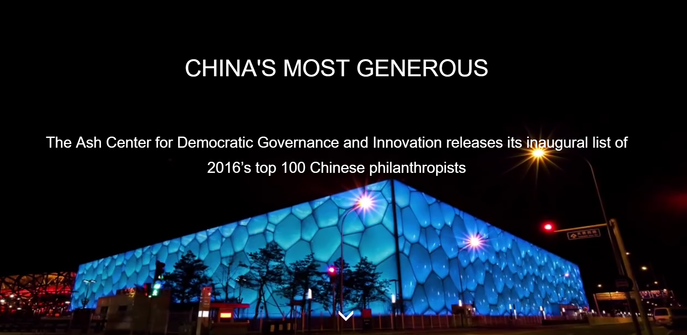

# Storymap：CHINA'S MOST GENEROUS 2016

## Breief Introduction of this Website

The rise of private wealth is one of the most important developments in modern China, with implications for the country’s social, economic, and political arenas. How individuals choose to deploy such resources will shape the relationships between the individual and the state, between the state and business, and between the state and the social sector.

This project aims to strengthen understanding of **China’s philanthropic landscape** by analyzing the makeup and choices of China’s most generous individuals. We hope the introduction of a metric on level of generosity, while imperfect, will add a new dimension to the discussion on how China’s wealthy choose to support charitable causes. We welcome comments and suggestions on our analysis and methodology through the email address listed below. The findings compile data from a variety of sources including media reports, company websites, corporate filings and trade journals. When possible we have further verified the data by directly contacting the philanthropist or the recipient of the gift.

We believe that an independent, verified, and research-oriented database on China's philanthropic giving will enable much-needed quantitative research on the sector and provide a crucial resource for government, academic, media, and non-profit organizations.

We will supplement the database with a range of case studies, white papers, academic articles, and interviews with leading philanthropists and leaders of philanthropic organizations.
